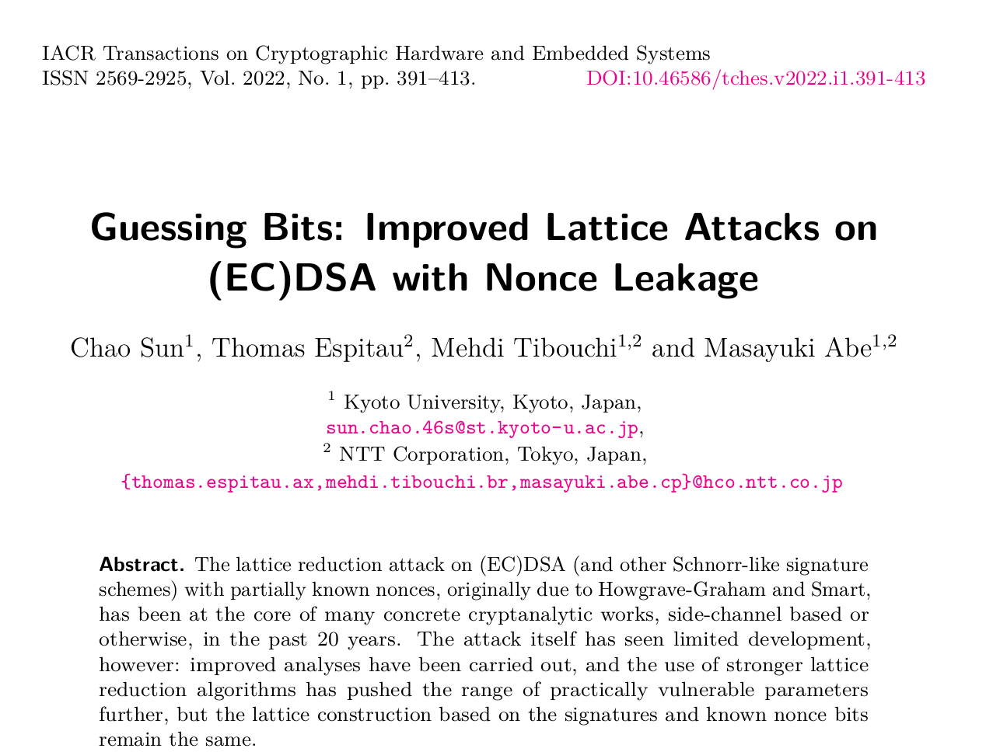

# GuessingBits-Improved-Lattice-Attacks-on-ECDSA-with-Nonce-Leakage
### Unofficial [LeetArxiv](https://leetarxiv.substack.com/p/guessing-bits-improved-lattice-attacks) implementation of the paper 'Guessing Bits: Improved Lattice Attacks on ECDSA with Nonce Leakage' in Python with Google Colab starter code

### Paper Summary
The paper _Guessing Bits: Improved Lattice Attacks on ECDSA with Nonce Leakage_ improves on the [(Albrecht & Heninger, 2020)](https://leetarxiv.substack.com/p/linear-hidden-number-problem-zero-to-hero-for-computer-scientiests) lattice-based HNP attack by:

1. Guessing some secret key bits to increase attack success probability.
2. Decomposing the secret key into batches to recover parts of the secret. ie. it’s no longer an ‘all-or-nothing’ approach.

### Getting Started
1. We provide Python code to load the dataset in `GuessingBits_Improved_Lattice_Attacks_on_ECDSA_with_Nonce_Leakage.ipynb`.
2. This [Google Colab notebook](https://colab.research.google.com/drive/1yQm7nzRHvUin0AGNQxQg1DWK1ODdljdk?usp=sharing) implementation if you're struggling to get `fpylll` running locally.

This code works best alongside this [written guide](https://leetarxiv.substack.com/p/guessing-bits-improved-lattice-attacks).

